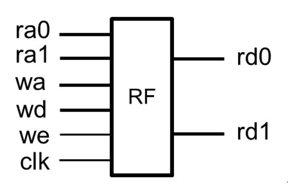
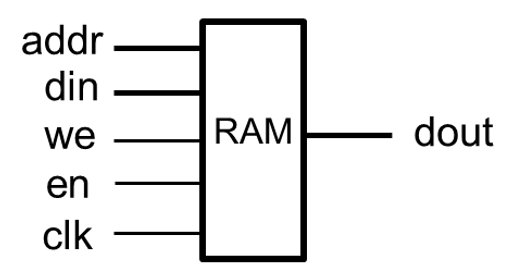

# <center>《计算机组成原理》<br/>实验报告</center>


<font size=3>


**&nbsp; &nbsp; &nbsp; &nbsp; &nbsp; &nbsp; &nbsp; &nbsp; &nbsp; &nbsp; &nbsp; &nbsp; &nbsp; &nbsp;&nbsp; &nbsp; &nbsp; &nbsp; &nbsp;  &nbsp; &nbsp; &nbsp; &nbsp; &nbsp; &nbsp;  &nbsp;实验题目：<u>寄存器堆与队列</u>**

**&nbsp; &nbsp; &nbsp;&nbsp; &nbsp; &nbsp; &nbsp; &nbsp; &nbsp; &nbsp; &nbsp; &nbsp; &nbsp; &nbsp; &nbsp; &nbsp; &nbsp; &nbsp; &nbsp; &nbsp; &nbsp; &nbsp; &nbsp; &nbsp; &nbsp; &nbsp; &nbsp;学生姓名：<u>王 志 强</u>**

**&nbsp;&nbsp; &nbsp; &nbsp; &nbsp; &nbsp; &nbsp; &nbsp; &nbsp; &nbsp; &nbsp; &nbsp; &nbsp; &nbsp; &nbsp; &nbsp; &nbsp; &nbsp; &nbsp; &nbsp; &nbsp; &nbsp; &nbsp; &nbsp; &nbsp; &nbsp;  学生学号：<u> PB18051049</u>**

**&nbsp;&nbsp; &nbsp;  &nbsp; &nbsp; &nbsp; &nbsp; &nbsp; &nbsp; &nbsp; &nbsp; &nbsp; &nbsp; &nbsp; &nbsp; &nbsp;&nbsp; &nbsp; &nbsp; &nbsp; &nbsp; &nbsp; &nbsp; &nbsp; &nbsp;  &nbsp; 完成日期：<u> 2020.05.04</u>**


</font>


**<center>计算机实验教学中心制</center>**

**<center>2019年9月</center>**


## **一、实验目标**

- 掌握寄存器堆（Register File）和存储器（Memory）的功能、时序及其应用；

- 熟练掌握数据通路和控制器的设计和描述方法。

## **二、实验内容**

### **1. 寄存器堆**

设计参数化的寄存器堆，其逻辑符号如下图所示。该寄存器堆含有32 个寄存器（r0 ~ r31，其中r0的内容恒定为零），寄存器的位宽由参数WIDTH指定，具有2个异步读端口和1个同步写端口。



- **根据端口和功能要求，Verilog代码实现如下：**

  ```verilog
  module register_file    //32×WIDTH寄存器堆
      #(parameter WIDTH = 32) //数据宽度
      (
      input clk,   //时钟，上升沿有效
      input [4:0] ra0, //读端口0地址
      output [WIDTH-1:0]  rd0,    //读端口0数据
      input [4:0] ra1, //读端口1地址
      output [WIDTH-1:0]  rd1,    //读端口1数据
      input [4:0] wa, //写端口地址
      input we,   //写使能，高电平有效
      input [WIDTH-1:0]  wd   //写端口数据    
      );
  
      parameter  NUM = 32;    //寄存器数量
      reg [WIDTH-1:0] REG_FILE [0:NUM-1]; //寄存器堆
      integer i;
  
      initial //仿真初始化
      for(i = 0;i < NUM;i = i + 1)
          REG_FILE[i]=0;
  	//异步读端口
      assign  rd0 = REG_FILE[ra0];
      assign  rd1 = REG_FILE[ra1];
      //写入端口
      always @(posedge clk)
      begin
          if(we)
              REG_FILE[wa] <= wd;
          REG_FILE[0] <= 0;   //R0恒为0
      end
  endmodule
  ```
  
- **RTL ANALYSIS-Schematic：**

  

- **Vivado仿真如下：**

  - **wa=ra0：**

    

  - **wa=ra1：**

    

  - **test_bench(tb_register_file.v):**

    ```verilog
    module tb_register_file;   
    
    // register_file Parameters
    parameter PERIOD = 10;     
    parameter WIDTH = 4;       
    
    // register_file Inputs
    reg   clk                                  = 0 ;
    reg   [4:0]  ra0                           = 0 ;
    reg   [4:0]  ra1                           = 0 ;
    reg   [4:0]  wa                            = 0 ;
    reg   we                                   = 0 ;
    reg   [WIDTH-1:0]  wd                      = 0 ;
    
    // register_file Outputs
    wire  [WIDTH-1:0]  rd0                     ;
    wire  [WIDTH-1:0]  rd1                     ;
    
    
    initial
    begin
        forever #(PERIOD/2)  clk=~clk;
    end
    
    initial
    begin
        forever #PERIOD we=~we;	//write enable
    end
    
    register_file #(4) u_register_file  (
        .clk                     ( clk              ),
        .ra0                     ( ra0  [4:0]       ),
        .ra1                     ( ra1  [4:0]       ),
        .wa                      ( wa   [4:0]       ),
        .we                      ( we               ),
        .wd                      ( wd   [WIDTH-1:0] ),
    
        .rd0                     ( rd0  [WIDTH-1:0] ),
        .rd1                     ( rd1  [WIDTH-1:0] )
    );
    //10组测试
    initial
    begin
        repeat(5) begin
        ra0 = $random%32;
        ra1 = $random%32;
        wa = ra0;
        wd = $random%16;
        #(PERIOD*2);
        end
        
        repeat(5)
        begin
        ra0 = $random%32;
        ra1 = $random%32;
        wa = ra1;
        wd = $random%16;
        #(PERIOD*2);
        end
        $finish;
    end
    endmodule
    ```

- **FPGA开发板测试如下：**
  
  - **返校后进行**

### 2、存储器：

存储器与寄存器堆的功能类似，都是用于存储信息，只是存储器的容量更大，配置方式更多，例如ROM/RAM、单端口/简单双端口/真正双端口、分布式/块式等方式。设计存储器可以通过行为方式描述，也可以通过IP例化方式实现。

例如，设计一容量为16 x 8位（即深度DEPTH：16，宽度WIDTH：8）的单端口RAM，其逻辑符号如图所示。用行为方式描述的Verilog代码如下：**（请补充代码中空缺的参数）**



```verilog
module  ram_16x8(			//16x8位单端口RAM
    input  clk, 			//时钟（上升沿有效）
	input en, we,				//使能，写使能
    input  [ 3:0 ]  addr,	//地址
    input  [ 2:0 ]  din,		//输入数据
    output [ 2:0 ]  dout	//输出数据
	);
    
    reg [ 3:0 ] addr_reg;
    reg [ 2:0 ] mem[ 0:3 ];

//初始化RAM的内容
	initial
	$readmemh(“初始化数据文件名”, mem); 

	assign dout = mem[addr_reg];

	always@(posedge clk) begin
  		if(en) begin
    		addr_reg <= addr;
    		if(we)
      			mem[addr] <= din;
  		end
end
endmodule

```

- **分布式存储器例化**

  - **分布式存储器例化界面—存储器配置：**

    

  - **分布式存储器例化界面—端口配置：**

    

  - **分布式存储器例化界面—复位和初始化：**

    

- **分布式存储器仿真波形**

  

  **test_bench(tb_dist_mem.v)：**

  ```verilog
  module tb_dist_mem;
  
  // dist_mem Parameters
  parameter PERIOD = 10; 
  
  // dist_mem Inputs
  reg   clk                                  = 0 ;
  reg   [3:0]  a                             = 0 ;
  reg   [7:0] d                              = 0 ;
  reg   we                                   = 0 ;
  
  // dist_mem Outputs
  wire  [7:0] spo                                ;
  
  initial
  begin
      forever #(PERIOD/2)  clk=~clk;
  end
  
  initial
  begin
      forever #PERIOD we=~we;	//write enable
  end
  
  dist_mem  u_dist_mem (
      .clk                     ( clk              ),
      .a                       ( a    [3:0]       ),
      .d                       ( d    [7:0]       ),
      .we                      ( we               ),
      .spo                     ( spo  [7:0]       )
  );
  
  initial
  begin
      repeat(3) begin
      a   = $random%16;
      d   = $random%256;
      #(PERIOD*2);
      end
  
      repeat(3)
      begin
      a   = $random%16;
      d   = $random%256;
      #(PERIOD*2);
      end
      a = 9;
      #(PERIOD*2);
      $finish;
  end
  endmodule
  ```

- **块式存储器例化**

  - **块式存储器例化界面—基本：**

    

  - **块式存储器例化界面—端口选项：**

    

  - **块式存储器例化界面—其他选项：**

    

- **块式存储器仿真波形**

  

  **test_bench(tb_blk_mem.v)：**

  ```verilog
  module tb_blk_mem;
  //和分布式存储器仿真文件基本相同
  //blk_mem Parameters
  parameter PERIOD = 10; 
  
  // blk_mem Inputs
  reg   clka                                 = 0 ;
  reg   [3:0]  addra                         = 0 ;
  reg   [7:0]  dina                          = 0 ;
  reg   ena                                  = 0 ;
  reg   wea                                  = 0 ;
  // blk_mem Outputs
  wire  [7:0] douta                              ;
  
  initial
  begin
      forever #(PERIOD/2)  clka=~clka;
  end
  
  initial
  begin
      forever #(PERIOD) wea=~wea;	//write enable
  end
  
  initial
  begin
      forever #(PERIOD*2) ena=~ena;	//top enable
  end
  
  blk_mem  u_blk_mem (
      .clka                    ( clka              ),
      .addra                   ( addra    [3:0]    ),
      .dina                    ( dina  [7:0]       ),
      .wea                     ( wea               ),
      .ena                     ( ena               ),
      .douta                   ( douta  [7:0]      )
  );
  
  initial
  begin
      repeat(3) begin
      addra = $random%16;
      dina  = $random%256;
      #(PERIOD*4);
      end
  
      repeat(3)
      begin
      addra = $random%16;
      dina  = $random%256;
      #(PERIOD*4);
      end
      $finish;
  end
  endmodule
  ```

- **分布式单端口RAM和块式单端口RAM对比**

  - block RAM增设总使能信号ena，dist RAM只有写使能信号we
  - block RAM输出需要时钟控制，ena有效情况下在时钟上升沿输出，为同步读取RAM
  - dist RAM异步读取，给出地址即可输出数据
  - block RAM存储空间较大，而dist RAM浪费LUT资源

### 3、先进先出(FIFO)队列

利用例化的存储器IP（16 x 8位块式的单端口RAM）和适当的逻辑电路，设计实现数据宽度为8位、最大长度为16的FIFO队列，其逻辑符号如图-9所示。入队列使能（en_in）有效时，将输入数据（din）加入队尾；出队列使能（en_out）有效时，将队列头数据输出（dout）。队列数据计数（count）指示队列中有效数据个数。当队列满（count = 16）时不能执行入队操作，队列空（count = 0）时不能进行出队操作。在入对使能信号的一次有效持续期间，仅允许最多入队一个数据，出队操作类似。


- **根据端口和功能要求，数据通路如下图所示：**

  

- **控制器状态转移图(write优先级高于read)**

  count共有16个值，理论上可以设置16个状态，但简单起见，也可设置三个有效状态：EMPTY、NORMAL和FULL，状态输出为full、empty标志以及count值。

  

  

- **RTL ANALYSIS-Schematic**

  

- **FIFO具体实现**

  - **顶层模块(fifo.v)：**

    ```verilog
    module fifo(
        input clk, rst,		//时钟（上升沿有效）、异步复位（高电平有效）
        input [7:0] din,		//入队列数据
        input en_in, 		//入队列使能，高电平有效
        input en_out,		//出队列使能，高电平有效
        output [7:0] dout, 	//出队列数据
        output [4:0] count	//队列数据计数
        );
        
        wire re,we;  //边沿信号
        wire ena;   //总使能
        wire wea;   //写使能
        wire empty,full;    //队列标志
        wire [3:0] pt_r,pt_w;   //队列指针
        wire [3:0] addr;    //RAM地址
        
        //结构化描述数据通路
        signal_edge re_gen(.clk(clk),.button(en_out) ,.button_edge(re));
        signal_edge we_gen(.clk(clk),.button(en_in),  .button_edge(we));
        
        //读写地址生成、选择
        pt_read pt_r_gen(.clk(clk),.rst(rst),.re(re),.we(we),
                         .empty(empty),.pt_r(pt_r));
        pt_write pt_w_gen (.clk(clk),.rst(rst),.we(we),.full (full ),.pt_w(pt_w));
        MUX2to1  mux(.m(we),.d0(pt_r),.d1(pt_w),.out(addr));//地址选择
        
        //状态机
        flag_FSM flag(.clk(clk),.rst(rst),
        we(we),.re(re),.full(full),.empty(empty),.count(count));
        
        //使能信号
        assign wea = we&(~full);
        assign ena = we|re;
        
        //访存
        blk_mem RAM(.clka(clk),.addra(addr),.dina(din),
                    .ena(ena),.wea(wea),.douta(dout));
        
    endmodule
    ```
  - **信号取边沿模块：**

    ```verilog
    //上学期数字电路实验方法
    module signal_edge(	
        input clk,
        input button,
        output button_edge
        );
        
        reg button_r1,button_r2;
        
        always@(posedge clk)
            button_r1 <= button;
        always@(posedge clk)
            button_r2 <= button_r1; 
        
        assign button_edge = button_r1 & (~button_r2);
        
    endmodule
    ```

  - **状态机&信号生成(write优先级高于read)：**

    ```verilog
    module flag_FSM
        #(parameter MAX_LEN = 16)
        (
        input clk,rst,
        input we,re,
        output reg full,empty,  //Moore型
        output reg [4:0] count  //Mealy型
        );
    
        parameter EMPTY = 2'b00;
        parameter NORMAL = 2'b01;
        parameter FULL = 2'b10;
        parameter OTHER = 2'b11;
    
        reg [1:0] current_state,next_state;	//states
    
        always @(posedge clk,posedge rst)
        begin
            if(rst)
                current_state <= EMPTY;
            else
                current_state <= next_state;
        end
        //设置优先级，write高于read
        always @(*)
        begin
        case(current_state)
        EMPTY:
            begin
            casex({we,re})
            2'b0x:begin next_state = EMPTY ; count = 0; end	//reamin
            2'b1x:begin next_state = NORMAL; count = 1; end	//PUSH
            endcase
            end
        NORMAL:
            begin
            casex({we,re})
            2'b00:begin next_state = NORMAL; count = count;end	//remain
            2'b01:	//POP
                begin
                count = count-1;
                if(count == 0)
                    next_state = EMPTY;	//empty
                else
                    next_state = NORMAL;
                end
            2'b1x:	//PUSH
                begin
                count = count+1;
                if(count == MAX_LEN)
                    next_state = FULL;	//full
                else
                    next_state = NORMAL;
                end
            endcase
            end
        FULL:
            begin
            casex({we,re})
            2'b00,2'b1x:begin next_state = FULL; count = count; end//remain
            2'b01:begin next_state =NORMAL;count = count-1; end	//POP
            endcase
            end
        OTHER:begin next_state = EMPTY; count = 0; end	//完全赋值
        endcase
        end
        //组合输出
        always @(*)
        begin
            case(current_state)	//flag
            EMPTY,OTHER:{empty,full} = 2'b10;
            NORMAL:{empty,full} = 2'b00;
            FULL:{empty,full} = 2'b01;
        endcase
        end
        
    endmodule
    ```

  - **队头指针生成：**

    ```verilog
    module pt_read
        #(parameter MAX_LEN = 16)
        (
        input clk,rst,
        input empty,
        input re,   //read enable
        input we,   //write enable
        output reg [3:0] pt_r
        );
    
        always @(posedge clk,posedge rst)
        begin
            if(rst)
                pt_r <= 4'b0000;    //复位
            else if({empty,re,we}==3'b010 ) //POP条件
                pt_r <= (pt_r+1)%MAX_LEN;
            else
                pt_r <= pt_r;
        end 
        
    endmodule
    ```

  - **队尾指针生成：**

    ```verilog
    module pt_write
        #(parameter MAX_LEN = 16)
        (
        input clk,rst,
        input full,
        input we,
        output reg [3:0] pt_w
        );    
    
        always @(posedge clk,posedge rst)
        begin
            if(rst)
                pt_w <= 4'b0000;
            else if(full==0 && we==1)
                pt_w <= (pt_w+1)%MAX_LEN;
            else
                pt_w <= pt_w;
        end
        
    endmodule
    ```

- **Vivado仿真如下：**

  

  **test_bench(tb_fifo.v)：**

  ```verilog
  module tb_fifo;        
  
  // fifo Parameters     
  parameter PERIOD  = 10;
      
  // fifo Inputs
  reg   clk                                  = 0 ;
  reg   rst                                  = 1 ;
  reg   [7:0]  din                           = 0 ;
  reg   en_in                                = 0 ;
  reg   en_out                               = 0 ;
  
  // fifo Outputs
  wire  [7:0]  dout                          ;
  wire  [4:0]  count                         ;
  
  initial
  begin
      forever #(PERIOD/2)  clk=~clk;
  end
  
  initial
  begin
      forever 
      #(3*PERIOD)  din = $random%256;
  end
  
  
  fifo  u_fifo (
      .clk                     ( clk           ),
      .rst                     ( rst           ),
      .din                     ( din     [7:0] ),
      .en_in                   ( en_in         ),
      .en_out                  ( en_out        ),
  
      .dout                    ( dout    [7:0] ),
      .count                   ( count   [4:0] )
  );
  
  initial
  begin
      #(PERIOD)   {en_in,en_out}=2'b00;
      #(PERIOD)   {en_in,en_out}=2'b01;   //POP
      #(PERIOD)   {en_in,en_out}=2'b10;   //PUSH
      #(PERIOD)   {en_in,en_out}=2'b00;   //remain
      #(PERIOD)   {en_in,en_out}=2'b01;   //POP
      #(PERIOD)   {en_in,en_out}=2'b00;   //remain
      
      repeat(2)
      begin
      #(PERIOD)   {en_in,en_out}=2'b10;   //PUSH
      #(PERIOD*2) {en_in,en_out}=2'b00;   //remain
      end
      
      repeat(14)
      begin
      #(PERIOD)   {en_in,en_out}=2'b10;   //PUSH
      #(PERIOD)   {en_in,en_out}=2'b00;   //remain
      end
      #(PERIOD)   {en_in,en_out}=2'b11;   //PUSH,full
      #(PERIOD)   {en_in,en_out}=2'b00;   //remain
      
      repeat(16)
      begin
      #(PERIOD)   {en_in,en_out}=2'b01;   //POP
      #(PERIOD)   {en_in,en_out}=2'b00;   //remain
      end
      
      #(PERIOD)	rst=1;	//reset
      #(PERIOD*10)   $finish;
  end
  endmodule
  ```
  
- **FPGA开发板测试：**

  - **返校后进行**

## 三、思考题

**Q：如何利用寄存器堆和适当电路设计实现可变个数的数据排序电路？**

**A：输入数据存入寄存器堆中，利用指针进行排序**

- **数据通路：**


- **部件功能表：**

  | 部件          | 功能                                            |
  | ------------- | ----------------------------------------------- |
  | Input Unit    | 数据输入，写到寄存器堆，按下done表示完成输入    |
  | Point Unit    | 状态控制，输出正在比较的两数据的地址            |
  | Swap Unit     | 交换控制，根据信号值和指针地址对寄存器堆修改    |
  | Register File | 寄存器堆，存储排序的数据                        |
  | ALU           | 减法操作，根据借位比较两数大小并反馈到Swap Unit |
