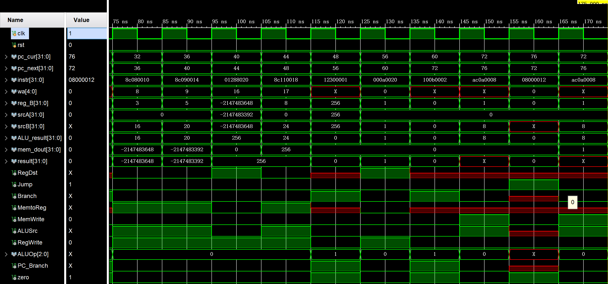
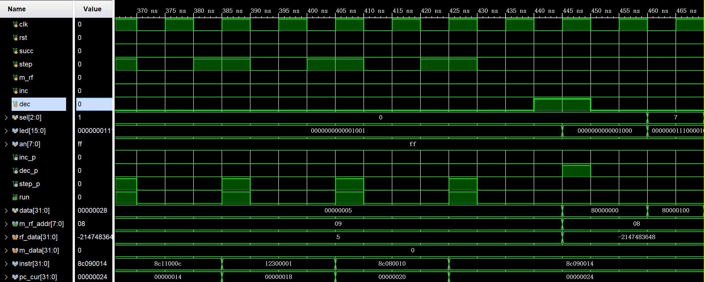

# <center>《计算机组成原理》<br/>实验报告</center>


<font size=3>


**&nbsp; &nbsp; &nbsp; &nbsp; &nbsp; &nbsp; &nbsp; &nbsp; &nbsp; &nbsp; &nbsp; &nbsp; &nbsp; &nbsp;&nbsp; &nbsp; &nbsp; &nbsp; &nbsp;  &nbsp; &nbsp; &nbsp; &nbsp; &nbsp; &nbsp;  &nbsp;实验题目：<u>单周期 CPU</u>**

**&nbsp; &nbsp; &nbsp;&nbsp; &nbsp; &nbsp; &nbsp; &nbsp; &nbsp; &nbsp; &nbsp; &nbsp; &nbsp; &nbsp; &nbsp; &nbsp; &nbsp; &nbsp; &nbsp; &nbsp; &nbsp; &nbsp; &nbsp; &nbsp; &nbsp; &nbsp; &nbsp;学生姓名：<u>王 志 强</u>**

**&nbsp;&nbsp; &nbsp; &nbsp; &nbsp; &nbsp; &nbsp; &nbsp; &nbsp; &nbsp; &nbsp; &nbsp; &nbsp; &nbsp; &nbsp; &nbsp; &nbsp; &nbsp; &nbsp; &nbsp; &nbsp; &nbsp; &nbsp; &nbsp; &nbsp; &nbsp;  学生学号：<u> PB18051049</u>**

**&nbsp;&nbsp; &nbsp;  &nbsp; &nbsp; &nbsp; &nbsp; &nbsp; &nbsp; &nbsp; &nbsp; &nbsp; &nbsp; &nbsp; &nbsp; &nbsp;&nbsp; &nbsp; &nbsp; &nbsp; &nbsp; &nbsp; &nbsp; &nbsp; &nbsp;  &nbsp; 完成日期：<u> 2020.05.12</u>**


</font>


**<center>计算机实验教学中心制</center>**

**<center>2019年9月</center>**


## **一、实验目标**

- 理解计算机硬件的基本组成、结构和工作原理；
- 掌握数字系统的设计和调试方法；
- 熟练掌握数据通路和控制器的设计和描述方法。

## **二、实验内容**

### **1. 单周期CPU**

待设计的单周期CPU可以执行如下6条指令：

- R类指令

  - add：rd <- rs + rt** &nbsp; **op = 000000, funct = 100000

  

- I类指令

  - addi：rt <- rs+imm &nbsp;op = 001000
  - lw：rt <- M(rs+addr) &nbsp;op = 100011
  - sw：M(rs+addr) <- rt &nbsp;op = 101011
  - beq：if(rs == rt) then pc <-pc+4+addr<<2; else pc <- pc+4 &nbsp;op = 000100

  

- J类指令

  - j：pc <- (pc+4)[31:28] | (add<<2)[27:0] &nbsp;op = 000010

  

待设计的CPU逻辑符号和端口声明如下：


```verilog
module cpu_one_cycle(	//单周期CPU
	input clk,			//时钟（上升沿有效）
	input rst			//异步复位，高电平有效
	);
	……
endmodule		
```

分析以上待实现指令的功能，设计CPU的数据通路和控制单元（橙色部分）如图-2所示，其中ALU和寄存器堆可以利用实验1和实验2设计的模块来实现，指令存储器ROM和数据存储器RAM均采用IP例化实现，容量为256 x 32位的分布式存储器。

<font color = red>注意：ALU control被并入到了Control模块，ALUOp为3位宽，直接传至ALU，移位和符号拓展模块直接在顶层模块中进行行为描述</font>


- **RTL ANALYSIS-Schematic(上下两图左右拼接)**

  

  


- **根据端口和功能要求，单周期cpu的顶层模块具体实现如下：**

  ```verilog
  module cpu(
      input clk,rst
      );
  
      wire [31:0] pc_cur,pc_next,pc_plus4,pc_jump,pc_beq,pc_result;
      wire [31:0] instr; //当前指令
      wire [4:0] wa;  //寄存器堆写入地址
      wire [31:0] Imm_signext,Imm_shift;  //符号拓展后的立即数,左移后的立即数
      wire [31:0] reg_B; //寄存器堆端口2读出数据
      wire [31:0] srcA,srcB,ALU_result; //ALU操作数,结果,SrcA也寄存器堆端口1数据
      wire [31:0] mem_dout,result;  //DM输出,写回结果
      wire RegDst,Jump,Branch,MemtoReg,MemRead,MemWrite,ALUSrc,RegWrite;	//控制信号
      wire [2:0] ALUOp;
      wire PC_Branch,zero;
  
  
      //data path
      pc PC(
          .clk			(clk			),
          .rst			(rst			),
          .pc_in			(pc_next		),
          .pc_out			(pc_cur			)
      );  //PC
      ADD PCplus4(
          .a				(pc_cur			),
          .b				(32'd4			),
          .y				(pc_plus4		)
      );	//加法器实现pc+4
       assign pc_jump = {pc_plus4[31:28],instr[25:0],2'b00};	//j指令
  
      ROM IM(
          .a				(pc_cur[9:2]	),
          .spo			(instr			)
      );	//instr memory
      MUX2to1 reg_mux(
          .m				(RegDst			),
          .d0				(instr[20:16]	),
          .d1				(instr[15:11]	),
          .out			(wa				)
      );	//write rt or rd
      
      register_file Regs(
          .clk			(clk			), 
          .ra0			(instr[25:21]	),
          .rd0			(srcA			),
          .ra1			(instr[20:16]	),
          .rd1			(reg_B			), 
          .we				(RegWrite		),
          .wa				(wa				),
          .wd				(result			)
      );	//register file
  
      Control_Unit Control(
          .op				(instr[31:26]	),
          .RegDst			(RegDst			),
          .Jump			(Jump			),
          .Branch			(Branch			),
          .MemtoReg		(MemtoReg		),
          .MemRead		(MemRead		),	//未使用
          .MemWrite		(MemWrite		),
          .ALUSrc			(ALUSrc			),
          .RegWrite		(RegWrite		),
          .ALUOp			(ALUOp			)
      );	//control unit
  
      MUX2to1 srcB_mux(
          .m				(ALUSrc			),
          .d0				(reg_B			),
          .d1				(Imm_signext	),
          .out			(srcB			)
      );     //src
      alu ALU(
          .a				(srcA			),
          .b				(srcB			),
          .m				(ALUOp			),
          .y				(ALU_result		),
          .zf				(zero			)
      );  //alu
      
      assign Imm_signext = {{16{instr[15]}},instr[15:0]};	//sign extend
      assign Imm_shift = (Imm_signext<<2);    //shift left2
      
      ADD PC_beq(
          .a				(pc_plus4		),
          .b				(Imm_shift		),
          .y				(pc_beq			)
      );	//pc_beq or pc_plus4
      assign PC_Branch = zero&Branch;		//PC_Branch
      MUX2to1 beq_mux(
          .m				(PC_Branch		),
          .d0				(pc_plus4		),
          .d1				(pc_beq			),
          .out			(pc_result		)
      );
      MUX2to1 jump_mux(
          .m				(Jump			),
          .d0				(pc_result		),
          .d1				(pc_jump		),
          .out			(pc_next		)
      );
  
      RAM DM(
          .clk			(clk			),
          .we				(MemWrite		),
          .a				(ALU_result[9:2]),	//特别注意指令按字节寻址
          .d				(reg_B			),
          .spo			(mem_dout		)
      );
      MUX2to1 result_mux(
          .m				(MemtoReg		),
          .d0				(ALU_result		),
          .d1				(mem_dout		),
          .out			(result			)
      );
  
  endmodule
  ```

- **核心模块control unit实现**

  ```verilog
  module Control_Unit(
      input [5:0] op,
      output RegDst,Jump,Branch,MemtoReg,MemRead,MemWrite,ALUSrc,RegWrite,
      output [2:0] ALUOp  //待实现的指令有限，故直接生成alu控制信号
      );
  	//实现以下6条指令
      parameter add  = 6'b000000;
      parameter addi = 6'b001000;
      parameter lw   = 6'b100011;
      parameter sw   = 6'b101011;
      parameter beq  = 6'b000100;
      parameter j    = 6'b000010;
      //add_op = 000,sub_op = 000
      reg [10:0]  control;
      assign {RegDst,Jump,Branch,MemtoReg,MemRead,
              MemWrite,ALUSrc,RegWrite,ALUOp} = control;
  
      always @(op)
      begin
          case(op)
          add : control = 11'b10000001000;
          addi: control = 11'b00000011000;
          lw  : control = 11'b00011011000;
          sw  : control = 11'bx00x0110000;
          beq : control = 11'bx01x0000001;
          j   : control = 11'bx1xx00x0xxx;
          default: control = 11'bxxxxxxxxxx;
          endcase
      end
  endmodule
  ```

- **仿真MIPS指令**

  ```assembly
  # 本文档存储器以字节编址
  # 初始PC = 0x00000000
  
  .data
      .word 0,6,0,8,0x80000000,0x80000100,0x100,5,0   #编译成机器码时，编译器会在前面多加个0，所以后面lw指令地址会多加4
  
  _start:    
  		addi $t0,$0,3       	#t0=3   0
          addi $t1,$0,5   		#t1=5	4
  		addi $t2,$0,1       	#t2=1	8
  		addi $t3,$0,0			#t3=0	12
  
          add  $s0,$t1,$t0  		#s0=t1+t0=8  测试add指令	16
          lw   $s1,12($0)  		#							20
          beq  $s1,$s0,_next1		#正确跳到_next 				24
  		
  		j _fail					
  
  _next1:	
  		lw $t0, 16($0)			#t0 = 0x80000000	32
  		lw $t1, 20($0)			#t1 = 0x80000100	36
  		
  		add  $s0,$t1,$t0		#s0 = 0x00000100 = 256	40
  		lw $s1, 24($0)			#						44
          beq  $s1,$s0,_next2		#正确跳到_success		48
  		
  		j _fail
  
  _next2:
  		add $0, $0, $t2			#$0应该一直为0			56
  		beq $0,$t3,_success		#						60
  		
  _fail:  
  		sw   $t3,8($0) #失败通过看存储器地址0x08里值，若为0则测试不通过，最初地址0x08里值为0
          j    _fail
  
  _success: 
  		sw   $t2,8($0)    #全部测试通过，存储器地址0x08里值为1
  		j   _success       
  					  #判断测试通过的条件是最后存储器地址0x08里值为1，说明全部通过测试
  ```

- **cpu仿真波形及解释**

  此处可以看到7条指令的仿真(4条addi，1条add，1条lw，1条beq)，图中可以清楚看到指令执行时各部件的端口值，如pc值、寄存器堆输出端口、ALU结果、控制信号、data memory输出等。

  pc_cur = 24时，为beq指令，可以看到分支成功，pc_next = 32，转而执行lw指令

  

  下图仿真了剩余指令，其中包括beq，add，lw，sw，j指令。

  pc_cur = 60时，为j指令，可以看到pc_next = 72，分支成功，最后根据mem_dout = 1可知x08 = 1

  

### 2、调试单元Debug Unit(DBU)

为了方便下载调试，设计一个调试单元DBU，该单元可以用于控制CPU的运行方式，显示运行过程的中间状态和最终运行结果。DBU的端口与CPU以及FPGA开发板外设（拨动/按钮开关、LED指示灯、7-段数码管）的连接如下图所示。为了DBU在不影响CPU运行的情况下，随时监视CPU运行过程中寄存器堆和数据存储器的内容，可以为寄存器堆和数据存储器增加1个用于调试的读端口。


<center><font color=red>注：图中省略了clk和rst信号</font><center/>

- **RTL ANALYSIS-Schematic(顶层模块——连接图)**

  

- **文件架构**

  

- **顶层模块具体实现**

  ```verilog
  module dbu_top(
      input clk,rst,  //时钟，复位
      input succ,step,    //连续执行，单步执行
      input m_rf,inc,dec, //M/R选择，地址加减
      input [2:0] sel,    //输出控制
      output [15:0] led,  //led
      output [7:0] an,    //seven segment enable
      output [7:0] seg    //seven segment output
      );
  
      wire run;
      wire [235:0] status;
      wire [31:0] m_data,rf_data;
      wire [7:0] m_rf_addr;
  	//data path
      Debug_Unit dbu(
          .clk            (clk        ),
          .rst            (rst        ),
          .succ           (succ       ),
          .step           (step       ),
          .sel            (sel        ),
          .m_rf           (m_rf       ),
          .inc            (inc        ),
          .dec            (dec        ),
          .status         (status     ),
          .m_data         (m_data     ),
          .rf_data        (rf_data    ),
          .run            (run        ),
          .m_rf_addr      (m_rf_addr  ),
          .led            (led        ),
          .an             (an         ),
          .seg            (seg        )
      );
  
      cpu cpu(
          .clk            (clk        ),
          .rst            (rst        ),
          .run            (run        ),
          .m_rf_addr      (m_rf_addr  ),
          .status         (status     ),
          .m_data         (m_data     ),
          .rf_data        (rf_data    )
      );
  
  endmodule
  ```

- **核心模块DBU具体实现**

  ```verilog
  module Debug_Unit(
      input clk,rst,  //时钟，复位
      input succ,step,    //连续执行，单步执行
      input m_rf,inc,dec, //M/R选择，addr加减
      input [2:0] sel,    //cpuc查看选择
      input [235:0] status,    //pc_in,pc_out,instr,rf_rd1,rf_rd2,alu_y,m_rd,signal
      input [31:0] m_data,rf_data,	//数据读出
      output run,  //cpu控制，数码管控制
      output  [7:0] an,	//数码管使能
      output reg [7:0] m_rf_addr,	//地址
      output reg [15:0] led,	//led
      output  [7:0] seg	//数码管显示信号
      );
  
      //wire step_clr,inc_clr,dec_clr;
      wire step_p,inc_p,dec_p;
      reg [31:0] data;
      //信号处理,按键需处理，扳动无需处理
      //上板时要去抖动，仿真时先注释
      //jitter_clr step_BTNC(clk,step,step_clr);
      //jitter_clr inc_BTNU(clk,inc,inc_clr);
      //jitter_clr dec_BUND(clk,dec,dec_clr);
      signal_edge step_edge(clk,step,step_p); 
      signal_edge inc_edge(clk,inc,inc_p);
      signal_edge dec_edge(clk,dec,dec_p);
  
      assign run = succ|step_p; //run信号
  
      //m_rf_addr
      wire inc_dec;
      assign inc_dec = inc_p|dec_p;	//fpga触发器只能有一个复位、一个时钟
      always @(posedge inc_dec,posedge rst)
      begin
          if(rst)
              m_rf_addr = 0;
          else
          begin
              case({inc_p,dec_p})
              2'b00,2'b11:m_rf_addr <= m_rf_addr;
              2'b01:m_rf_addr <= m_rf_addr-1;
              2'b10:m_rf_addr <= m_rf_addr+1;
              endcase
          end
      end
  
  
      always @(*)
      begin
          led = {{4{1'b0}},status[11:0]};
          case(sel)
          3'b000: 
          begin
              led = {{8{1'b0}},m_rf_addr};
              if(m_rf)
                  data = m_data;
              else
                  data = rf_data;
          end
          3'b001:data = status[235:204];   //pc_in
          3'b010:data = status[203:172];   //pc_out
          3'b011:data = status[171:140];   //instr
          3'b100:data = status[139:108];   //rf_rd1
          3'b101:data = status[107: 76];   //rf_rd2
          3'b110:data = status[75 : 44];   //alu_y
          3'b111:data = status[43 : 12];   //m_rd
          endcase
      end
  
      seven_segment segment(clk,data,8'hFF,an,seg);
  
  endmodule
  
  ```

- **CPU模块相应修改(只展示修改部分)**

  ```verilog
  module cpu(
      input clk,rst,
      //为dbu增加端口
      input run,
      input [7:0] m_rf_addr,  //dbu读地址
      output [31:0] m_data,rf_data,	//R/D读出数据
      output [235:0] status	//CPU内部状态
      );
  
      /*...*/
      //以下代码供dbu使用
      //修改时钟信号，后续时钟信号都用clk_p
      wire clk_p; 
      assign clk_p = clk&run;
      assign status = {pc_next,pc_cur,instr,srcA,reg_B,ALU_result,mem_dout,
          Jump,Branch,RegDst,RegWrite,MemRead,MemtoReg,MemWrite,ALUOp,ALUSrc,zero};
  	/*...*/
      
  endmodule
  ```

- **DBU波形仿真及解释**

  这里显示了我们的第一条指令，图中可以看到sel、step、inc的控制效果以及各端口的输出值。可以看到，当m_rf_addr=8且m_rf=0时，输出寄存器t0的值，为3，与指令结果相符，同时led显示我们的输入地址值8：

  

  下面，我们可以看到后续若干条指令的执行，以及Register File和Data Memory的输出：

  

  接下来，在ADD指令下，我们切换不同的sel信号，来验证输出的正确性：

  

  检察后续若干条指令以及sel=7的输出值：

  

  翻到最后，可以看到m_data=1，符合预期：

  

- **FPGA开发板测试：**

  - **返校后进行**

## 三、实验总结

- **分析CPU的数据通路，并对其结构化描述，深入理解计算机硬件的基本组成、结构和工作原理；**
- **调试器DBU的设计，增强了数字系统设计能力和调试数字系统的能力；**
- **熟练掌握了数据通路和控制器的设计和描述方法。**

## 四、思考题

**Q： 修改数据通路和控制器，增加支持如下指令：**

​		**accm: rd <- M(rs) + rt;   op = 000000, funct = 101000**

​		

**A：设计方法、控制器代码如下：**

- **数据通路：**

  **增加了控制信号SrcA、D_addr分布作为ALU的A端输入选择和Data Memory地址输入选择，在ALU的A端输入增加了MUX2to1，Data Memory地址端增加了MUX2to1**

  

- **Control Unit：**

  ```verilog
  module Control_Unit(
      input [5:0] op,
      output RegDst,Jump,Branch,MemtoReg,MemRead,MemWrite,ALUSrc,RegWrite,
      output [2:0] ALUOp,  //待实现的指令有限，故直接生成alu控制信号
      output SrcA,D_addr
      );
      parameter add  = 6'b000000;
      parameter addi = 6'b001000;
      parameter lw   = 6'b100011;
      parameter sw   = 6'b101011;
      parameter beq  = 6'b000100;
      parameter j    = 6'b000010;
      parameter accm = 6'b000000;
      //add_op = 000,sub_op = 000
      reg [12:0]  control;
      assign {RegDst,Jump,Branch,MemtoReg,MemRead,MemWrite,
              ALUSrc,RegWrite,ALUOp,SrcA,D_addr}=control;
  
      always @(op)
      begin
          case(op)
          add : control = 13'b1000000100000;
          addi: control = 13'b0000001100000;
          lw  : control = 13'b0001101100000;
          sw  : control = 13'bx00x011000000;
          beq : control = 13'bx01x000000100;
          j   : control = 13'bx1xx00x0xxx00;
          accm: control = 13'b1000100100011;
          default: control = 13'bxxxxxxxxxxxx;
          endcase
      end
  endmodule
  ```
