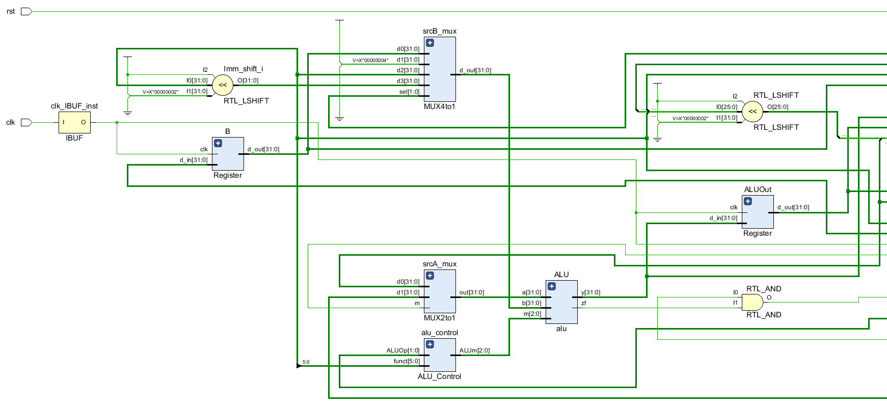

# <center>《计算机组成原理》<br/>实验报告</center>


<font size=3>


**&nbsp; &nbsp; &nbsp; &nbsp; &nbsp; &nbsp; &nbsp; &nbsp; &nbsp; &nbsp; &nbsp; &nbsp; &nbsp; &nbsp;&nbsp; &nbsp; &nbsp; &nbsp; &nbsp;  &nbsp; &nbsp; &nbsp; &nbsp; &nbsp; &nbsp;  &nbsp;实验题目：<u>多周期 CPU</u>**

**&nbsp; &nbsp; &nbsp;&nbsp; &nbsp; &nbsp; &nbsp; &nbsp; &nbsp; &nbsp; &nbsp; &nbsp; &nbsp; &nbsp; &nbsp; &nbsp; &nbsp; &nbsp; &nbsp; &nbsp; &nbsp; &nbsp; &nbsp; &nbsp; &nbsp; &nbsp; &nbsp;学生姓名：<u>王 志 强</u>**

**&nbsp;&nbsp; &nbsp; &nbsp; &nbsp; &nbsp; &nbsp; &nbsp; &nbsp; &nbsp; &nbsp; &nbsp; &nbsp; &nbsp; &nbsp; &nbsp; &nbsp; &nbsp; &nbsp; &nbsp; &nbsp; &nbsp; &nbsp; &nbsp; &nbsp; &nbsp;  学生学号：<u> PB18051049</u>**

**&nbsp;&nbsp; &nbsp;  &nbsp; &nbsp; &nbsp; &nbsp; &nbsp; &nbsp; &nbsp; &nbsp; &nbsp; &nbsp; &nbsp; &nbsp; &nbsp;&nbsp; &nbsp; &nbsp; &nbsp; &nbsp; &nbsp; &nbsp; &nbsp; &nbsp;  &nbsp; 完成日期：<u> 2020.05.25</u>**


</font>


**<center>计算机实验教学中心制</center>**

**<center>2019年9月</center>**


## **一、实验目标**

- 理解计算机硬件的基本组成、结构和工作原理；
- 掌握数字系统的设计和调试方法；
- 熟练掌握数据通路和控制器的设计和描述方法。

## **二、实验内容**

### **1. 多周期CPU**

待设计的多周期CPU可以执行如下6条指令：

- R类指令

  - add：rd <- rs + rt** &nbsp; **op = 000000, funct = 100000

  

- I类指令

  - addi：rt <- rs+imm &nbsp;op = 001000
  - lw：rt <- M(rs+addr) &nbsp;op = 100011
  - sw：M(rs+addr) <- rt &nbsp;op = 101011
  - beq：if(rs == rt) then pc <-pc+4+addr<<2; else pc <- pc+4 &nbsp;op = 000100

  

- J类指令

  - j：pc <- (pc+4)[31:28] | (add<<2)[27:0] &nbsp;op = 000010

  

待设计的CPU逻辑符号和端口声明如下：


```verilog
module cpu_one_cycle(	//单周期CPU
	input clk,			//时钟（上升沿有效）
	input rst			//异步复位，高电平有效
	);
	……
endmodule		
```

#### 1.1 数据通路

满足上述指令的功能，设计多周期CPU的数据通路和控制器（橙色部分）如下图所示。具体实现时ALU和寄存器堆可以利用实验1和实验2设计的模块，指令和数据存储共用一个RAM存储器，采用IP例化实现，容量为512 x 32位的分布式存储器。

<font color = red>注意：ALU control输出信号对应lab1中的alu控制信号，移位和符号拓展模块直接在顶层模块中进行行为描述</font>


#### 1.2 控制器状态图（补充addi指令）

根据各类指令在每个阶段完成的工作，设计控制器状态图，如下


#### 1.3 RTL ANALYSIS-Schematic

<font color=red>从上至下左右拼接</font>




#### 1.4 核心模块Verilog实现

##### 1.4.1 多周期CPU顶层模块

根据端口和功能要求，多周期cpu的顶层模块具体实现如下：

```verilog
module cpu(
    input clk,rst
    );

    wire [31:0] pc_cur,pc_next,pc_jump; //pc
    wire [31:0] MEMdata; //取出的指令或者数据
    wire [31:0] MEM_addr;
    wire [5:0]  IR_op;    //op,传给control unit
    wire [4:0]  IR_rs,IR_rt;  //rs,rt   
    wire [15:0] IR_Imm;    //指令后16位
    wire [31:0] MDR_out;  //MDR输出数据
    wire [4:0] Reg_addr;  //寄存器堆写入地址
    wire [31:0] Reg_data;  //寄存器堆写入数据
    wire [31:0] Imm_signext,Imm_shift;  //符号拓展后的立即数,左移后的立即数
    wire [31:0] rdA,rdB;    //寄存器堆两端口输出数据
    wire [31:0] regA,regB;  //A,B寄存器端口读出数据
    wire [31:0] srcA,srcB,ALU_result; //ALU操作数,结果
    wire [2 :0] ALUm;   //ALU控制信号
    wire [31:0] ALUout;     //ALUOut寄存器输出
    wire ALUzero,PCwe;  //alu零输出标志，PC寄存器写使能
    /*下面为控制信号*/
    wire PCWriteCond,PCWrite,IorD,MemRead,MemWrite; //MemRead暂时不用
    wire MemtoReg,IRWrite,RegDst,RegWrite,ALUSrcA;
    wire [1:0] ALUSrcB,ALUOp,PCSource;	
    
    //data path
    assign PCwe = PCWrite|(PCWriteCond&ALUzero);
    pc PC(
        .clk			(clk			),
        .rst			(rst			),
        .we             (PCwe           ),
        .pc_in			(pc_next		),
        .pc_out			(pc_cur			)
    );  //PC

    MUX2to1 MEMaddr_addr(
        .m              (IorD           ),
        .d0             (pc_cur         ),
        .d1             (ALUout         ),
        .out            (MEM_addr       )
    );

    RAM Memory(
        .clk            (clk            ),
        .we             (MemWrite       ),
        .a              (MEM_addr[10:2] ),
        .d              (regB           ),
        .spo            (MEMdata        )
    );

    Instr_Reg IR(
        .clk            (clk            ),
        .IRWrite        (IRWrite        ),
        .d_in           (MEMdata        ),  //instr
        .d_out0         (IR_op          ),  //op
        .d_out1         (IR_rs          ),  //rs
        .d_out2         (IR_rt          ),  //rt
        .d_out3         (IR_Imm         )   //末16位
    );   //IR

    Register MDR(
        .clk            (clk            ),
        .d_in           (MEMdata        ),
        .d_out          (MDR_out        )
    );   //MDR

    MUX2to1 reg_a(
        .m				(RegDst			),
        .d0				(IR_rt      	),
        .d1				(IR_Imm[15:11]	),
        .out			(Reg_addr  		)
    );	//write rt or rd

    MUX2to1 reg_d(
        .m              (MemtoReg       ),
        .d0             (ALUout         ),
        .d1             (MDR_out        ),
        .out            (Reg_data       )
    );

    register_file Regs(
        .clk			(clk			), 
        .ra0			(IR_rs      	),
        .rd0			(rdA			),
        .ra1			(IR_rt      	),
        .rd1			(rdB			), 
        .we				(RegWrite		),
        .wa				(Reg_addr		),
        .wd				(Reg_data		)
    );	//register file

    Register A(
        .clk            (clk            ),
        .d_in           (rdA            ),
        .d_out          (regA           )
    );

    Register B(
        .clk            (clk            ),
        .d_in           (rdB            ),
        .d_out          (regB           )
    );

    MUX2to1 srcA_mux(
        .m              (ALUSrcA        ),
        .d0             (pc_cur         ),
        .d1             (regA           ),
        .out            (srcA           )
    );

    assign Imm_signext = {{16{IR_Imm[15]}},IR_Imm}; //sign extend
    assign Imm_shift = (Imm_signext<<2);    //shift left2
    MUX4to1 srcB_mux(
        .sel            (ALUSrcB        ),
        .d0             (regB           ),
        .d1             (32'd4          ),
        .d2             (Imm_signext    ),
        .d3             (Imm_shift      ),
        .d_out          (srcB           )
    );

    alu ALU(
        .a				(srcA			),
        .b				(srcB			),
        .m				(ALUm			),
        .y				(ALU_result		),
        .zf				(ALUzero		)
    );  //alu

    Register ALUOut(
        .clk            (clk            ),
        .d_in           (ALU_result     ),
        .d_out          (ALUout         )
    );

    
    assign pc_jump = {pc_cur[31:28],{{IR_rs,IR_rt,IR_Imm}<<2}};
    MUX4to1 pc_mux(
        .sel            (PCSource       ),
        .d0             (ALU_result     ),
        .d1             (ALUout         ),
        .d2             (pc_jump        ),
        .d3             (32'd0          ),
        .d_out          (pc_next        )
    );

    //FSM,Control Unit
    Control_Unit FSM(
        .clk            (clk            ),
        .rst            (rst            ),
        .op             (IR_op          ),
        .PCWriteCond    (PCWriteCond    ),
        .PCWrite        (PCWrite        ),
        .IorD           (IorD           ),
        .MemRead        (MemRead        ),
        .MemWrite       (MemWrite       ),
        .MemtoReg       (MemtoReg       ),
        .IRWrite        (IRWrite        ),
        .RegDst         (RegDst         ),
        .RegWrite       (RegWrite       ),
        .ALUSrcA        (ALUSrcA        ),
        .ALUSrcB        (ALUSrcB        ),
        .ALUOp          (ALUOp          ),
        .PCSource       (PCSource       )
    );

    ALU_Control alu_control(
        .ALUOp          (ALUOp          ),
        .funct          (IR_Imm[5:0]    ),
        .ALUm           (ALUm           )
    );
endmodule
```

- **核心模块control unit实现**

  ```verilog
  module Control_Unit(
      input [5:0] op,
      output RegDst,Jump,Branch,MemtoReg,MemRead,MemWrite,ALUSrc,RegWrite,
      output [2:0] ALUOp  //待实现的指令有限，故直接生成alu控制信号
      );
  	//实现以下6条指令
      parameter add  = 6'b000000;
      parameter addi = 6'b001000;
      parameter lw   = 6'b100011;
      parameter sw   = 6'b101011;
      parameter beq  = 6'b000100;
      parameter j    = 6'b000010;
      //add_op = 000,sub_op = 000
      reg [10:0]  control;
      assign {RegDst,Jump,Branch,MemtoReg,MemRead,
              MemWrite,ALUSrc,RegWrite,ALUOp} = control;
  
      always @(op)
      begin
          case(op)
          add : control = 11'b10000001000;
          addi: control = 11'b00000011000;
          lw  : control = 11'b00011011000;
          sw  : control = 11'bx00x0110000;
          beq : control = 11'bx01x0000001;
          j   : control = 11'bx1xx00x0xxx;
          default: control = 11'bxxxxxxxxxx;
          endcase
      end
  endmodule
  ```

##### 1.4.2 控制器状态机模块

```verilog
module Control_Unit(
    input clk,rst,
    input [5:0] op,
    output PCWriteCond,PCWrite,IorD,MemRead,MemWrite,
    output MemtoReg,IRWrite,RegDst,RegWrite,ALUSrcA,
    output [1:0] ALUSrcB,ALUOp,PCSource
    );
    //instr parameter
    parameter add  = 6'b000000;
    parameter addi = 6'b001000;
    parameter lw   = 6'b100011;
    parameter sw   = 6'b101011;
    parameter beq  = 6'b000100;
    parameter j    = 6'b000010;

    //state parameter
    parameter IF        = 4'b0000;
    parameter ID        = 4'b0001;
    parameter LS_EX     = 4'b0010;
    parameter LW_MEM    = 4'b0011;
    parameter LW_WB     = 4'b0100;
    parameter SW_MEM    = 4'b0101;
    parameter R_EX      = 4'b0110;
    parameter R_WB      = 4'b0111;
    parameter BEQ_EX    = 4'b1000;
    parameter J_EX      = 4'b1001;
    parameter I_EX      = 4'b1010;
    parameter I_WB      = 4'b1011;

    reg [3:0] cur_state,next_state;
    reg [15:0]  control;

    assign {PCWriteCond,PCWrite,IorD,MemRead,MemWrite,MemtoReg,IRWrite,
            RegDst,RegWrite,ALUSrcA,ALUSrcB,ALUOp,PCSource}=control;
    //三段式描述状态机
    always @(posedge clk,posedge rst)
    begin
        if(rst)
            cur_state <= IF;
        else
            cur_state <= next_state;
    end
    //状态转移条件
    always @(*)
    begin
        case(cur_state)
        IF:         next_state = ID;
        ID:     
            case(op)
            add:    next_state = R_EX;
            addi:   next_state = I_EX;
            lw,sw:  next_state = LS_EX;
            beq:    next_state = BEQ_EX;
            j:      next_state = J_EX;
            default:next_state = 4'b0000;
            endcase
        LS_EX:
            case(op)
            lw:     next_state = LW_MEM;
            sw:     next_state = SW_MEM;
            default:next_state = 4'b0000;
            endcase
        LW_MEM:     next_state = LW_WB;
        R_EX:       next_state = R_WB;
        I_EX:       next_state = I_WB;
        LW_WB,SW_MEM,R_WB,I_WB,BEQ_EX,J_EX:
                    next_state = IF;
        default:    next_state = 4'b0000;
        endcase
    end
    //状态输出
    always @(cur_state)
    begin
        case(cur_state)
        IF:     control = 16'b0101001000010000;
        ID:     control = 16'b0000000000110000;
        LS_EX:  control = 16'b0000000001100000;
        LW_MEM: control = 16'b0011000000000000;
        LW_WB:  control = 16'b0000010010000000;
        SW_MEM: control = 16'b0010100000000000;
        R_EX:   control = 16'b0000000001001000;
        R_WB:   control = 16'b0000000110000000;
        I_EX:   control = 16'b0000000001100000;
        I_WB:   control = 16'b0000000010000000;
        BEQ_EX: control = 16'b1000000001000101;
        J_EX:   control = 16'b0100000000000010;
        default:control = 16'b0000000000000000;
        endcase
    end
endmodule
```

#### 1.5 波形仿真

##### 1.5.1仿真MIPS指令

```assembly
# 初始PC = 0x00000000

	j _start	# 0

.data
    .word 0,6,0,8,0x80000000,0x80000100,0x100,5,0,0,0   
    #编译成机器码时，编译器会在前面多加个0，所以后面lw指令地址会多加4

_start:    
		addi $t0,$0,3       	#t0=3  	44
        addi $t1,$0,5   		#t1=5	48
		addi $t2,$0,1       	#t2=1	52
		addi $t3,$0,0			#t3=0	56

        add  $s0,$t1,$t0  		#s0=t1+t0=8  测试add指令	60
        lw   $s1,12($0)  		#							64
        beq  $s1,$s0,_next1		#正确跳到_next 				68
		
		j _fail					

_next1:	
		lw $t0, 16($0)			#t0 = 0x80000000	76
		lw $t1, 20($0)			#t1 = 0x80000100	80
		
		add  $s0,$t1,$t0		#s0 = 0x00000100 = 256	84
		lw $s1, 24($0)			#						88
        beq  $s1,$s0,_next2		#正确跳到_success		92
		
		j _fail

_next2:
		add $0, $0, $t2			#$0应该一直为0			100
		beq $0,$t3,_success		#						104
		
		
_fail:  
		sw   $t3,8($0) #失败通过看存储器地址0x08里值，若为0则测试不通过，最初地址0x08里值为0 108
        j    _fail

_success: 
		sw   $t2,8($0)    #全部测试通过，存储器地址0x08里值为1	116
		j   _success       
#判断测试通过的条件是最后存储器地址0x08里值为1，说明全部通过测试
```

##### 1.5.2 cpu仿真波形及解释

根据上述汇编指令，10个周期一组，仿真波形如下，cpu内部变量在各阶段的值在图中能看到，不一一解释

###### 1.5.2.1 第一组（1-10 cycle）


###### 1.5.2.2 第二组（11-20 cycle）


###### 1.5.2.3 第三组（21-30 cycle）


###### 1.5.2.4 第四组（31-40 cycle）


###### 1.5.2.5 第五组（41-50 cycle）


###### 1.5.2.6 第六组（51-60 cycle）


###### 1.5.2.7 第七组（61-71cycle）

<font color =red>最后在sw和j指令循环，可以看到第71个周期，MEM_addr地址为x01，MDR_OUT输出为1，即代表内存x08的值为1，测试通过</font>


### 2、调试单元Debug Unit(DBU)

为了方便下载调试，设计一个调试单元DBU，该单元可以用于控制CPU的运行方式，显示运行过程的中间状态和最终运行结果。DBU的端口与CPU以及FPGA开发板外设（拨动/按钮开关、LED指示灯、7-段数码管）的连接如下图所示。为了DBU在不影响CPU运行的情况下，随时监视CPU运行过程中寄存器堆和数据存储器的内容，可以为寄存器堆和数据存储器增加1个用于调试的读端口。


<center><font color=red>注：图中省略了clk和rst信号</font><center/>

#### 2.1 控制CPU运行方式

- succ = 1：clkd输出连续的周期性脉冲信号，可以作为CPU的时钟信号，控制CPU连续执行指令
- succ = 0：每按动step一次，clkd输出一个脉冲信号，可以作为CPU的时钟信号，控制CPU执行一个时钟周期
- sel = 0：查看CPU运行结果 (存储器或者寄存器堆内容)

  - m_rf： 1，查看存储器(MEM)；0，查看寄存器堆(RF)

  - m_rf_addr： MEM/RF的调试读口地址(字地址)，复位时为零

  - inc/dec：m_rf_addr加1或减1

  - rf_data/m_data：从RF/MEM读取的数据字

  - 16个LED指示灯显示m_rf_addr

  - 8个数码管显示rf_data/m_data
- sel = 1 ~ 7：查看CPU运行状态（status）
- 16个LED指示灯(SW15~SW0)依次显示控制器的控制信号PCSource(2)、PCwe、IorD、MemWrite、IRWrite、RegDst、MemtoReg、RegWrite、ALUm(3)、ALUSrcA、ALUSrcB(2) 和ALUZero 
- 8个数码管显示由sel选择的一个32位数据

  - sel = 1：PC，程序计数器
- sel = 2：IR，指令寄存器
  - sel = 3：MD, 存储器读出数据寄存器
- sel = 4：A, 寄存器堆读出寄存器A
  - sel = 5：B, 寄存器堆读出寄存器B
- sel = 6：ALUOut, ALU运算结果寄存器
  - sel = 7： 

#### 2.2 RTL ANALYSIS-Schematic(顶层模块——连接图)  

#### 2.3文件架构


#### 2.4 核心模块Verilog实现

##### 2.4.1 顶层模块

  ```verilog
  module dbu_top(
      input clk,rst,  //时钟，复位
      input succ,step,    //连续执行，单步执行
      input m_rf,inc,dec, //M/R选择，地址加减
      input [2:0] sel,    //输出控制
      output [15:0] led,  //led
      output [7:0] an,    //seven segment enable
      output [7:0] seg    //seven segment output
      );
  
      wire run;
      wire [207:0] status;
      wire [31:0] m_data,rf_data;
      wire [7:0] m_rf_addr;
  	//data path
      Debug_Unit dbu(
          .clk            (clk        ),
          .rst            (rst        ),
          .succ           (succ       ),
          .step           (step       ),
          .sel            (sel        ),
          .m_rf           (m_rf       ),
          .inc            (inc        ),
          .dec            (dec        ),
          .status         (status     ),
          .m_data         (m_data     ),
          .rf_data        (rf_data    ),
          .run            (run        ),
          .m_rf_addr      (m_rf_addr  ),
          .led            (led        ),
          .an             (an         ),
          .seg            (seg        )
      );
  
      cpu cpu(
          .clk            (clk        ),
          .rst            (rst        ),
          .run            (run        ),
          .m_rf_addr      (m_rf_addr  ),
          .status         (status     ),
          .m_data         (m_data     ),
          .rf_data        (rf_data    )
      );
  
  endmodule
  ```

##### 2.4.2 DBU模块具体实现

```verilog
module Debug_Unit(
    input clk,rst,  //时钟，复位
    input succ,step,    //连续执行，单步执行
    input m_rf,inc,dec, //M/R选择，addr加减
    input [2:0] sel,    //cpuc查看选择
    input [6*32+16-1:0] status,    //PC,IR,MD,A,B,ALUOut,signal
    input [31:0] m_data,rf_data,
    output run,  //cpu控制，数码管控制
    output  [7:0] an,
    output reg [7:0] m_rf_addr,
    output reg [15:0] led,
    output  [7:0] seg
    );

    //wire step_clr,inc_clr,dec_clr;
    wire step_p,inc_p,dec_p;
    reg [31:0] data;
    //信号处理,按键需处理，扳动无需处理
    //jitter_clr step_BTNC(clk,step,step_clr);
    //jitter_clr inc_BTNU(clk,inc,inc_clr);
    //jitter_clr dec_BUND(clk,dec,dec_clr);
    signal_edge step_edge(clk,step,step_p); //上板时记得修改
    signal_edge inc_edge(clk,inc,inc_p);
    signal_edge dec_edge(clk,dec,dec_p);

    assign run = succ|step_p; //run

    //m_rf_addr
    wire inc_dec;
    assign inc_dec = inc_p|dec_p;
    always @(posedge inc_dec,posedge rst)
    begin
        if(rst)
            m_rf_addr = 0;
        else
        begin
            case({inc_p,dec_p})
            2'b00,2'b11:m_rf_addr = m_rf_addr;
            2'b01:m_rf_addr = m_rf_addr-1;
            2'b10:m_rf_addr = m_rf_addr+1;
            endcase
        end
    end


    always @(*)
    begin
        led = {{4{1'b0}},status[11:0]};
        case(sel)
        3'b000: 
        begin
            led = {{8{1'b0}},m_rf_addr};
            if(m_rf)
                data = m_data;
            else
                data = rf_data;
        end
        3'b001:data = status[207:176];   //PC
        3'b010:data = status[175:144];   //IR
        3'b011:data = status[143:112];   //MD
        3'b100:data = status[111:80 ];   //A
        3'b101:data = status[79 :48 ];   //B
        3'b110:data = status[47 :16 ];   //ALUOut
        3'b111:data = status[15 :0  ];   //signal
        endcase
    end

    seven_segment segment(clk,data,8'hFF,an,seg);

endmodule
```

- **CPU模块相应修改(只展示修改部分)**

  ```verilog
  module cpu(
      input clk,rst,
      //为dbu增加端口
      input run,
      input [7:0] m_rf_addr,  //dbu读地址
      output [31:0] m_data,rf_data,	//R/D读出数据
      output [207:0] status	//CPU内部状态
      );
  
      /*...*/
      //以下代码供dbu使用
      //修改时钟信号，后续时钟信号都用clk_p
      wire clk_p; 
      assign clk_p = clk&run;
      assign status = {pc_cur,{IR_op,IR_rs,IR_rt,IR_Imm},MDR_out,
      regA,regB,ALUout,PCSource,PCwe,IorD,MemWrite,IRWrite,RegDst,
      MemtoReg,RegWrite,ALUm,ALUSrcA,ALUSrcB,ALUzero};
  	/*...*/
      
  endmodule
  ```

  ##### 2.5 FPGA开发板测试：

  **返校后进行**

## 三、实验总结

- **分析CPU的数据通路，并对其结构化描述，深入理解计算机硬件的基本组成、结构和工作原理；**
- **调试器DBU的设计，增强了数字系统设计能力和调试数字系统的能力；**
- **熟练掌握了数据通路和控制器的设计和描述方法。**
